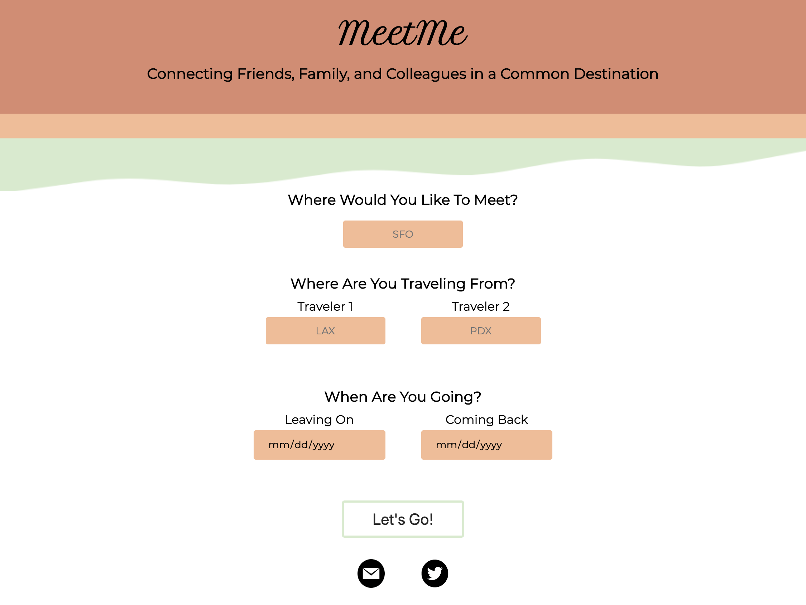
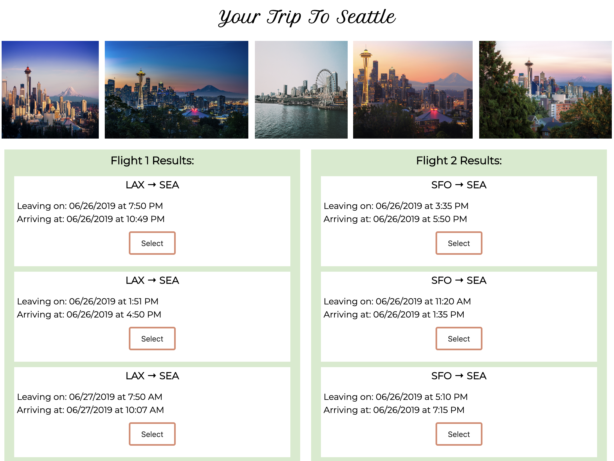
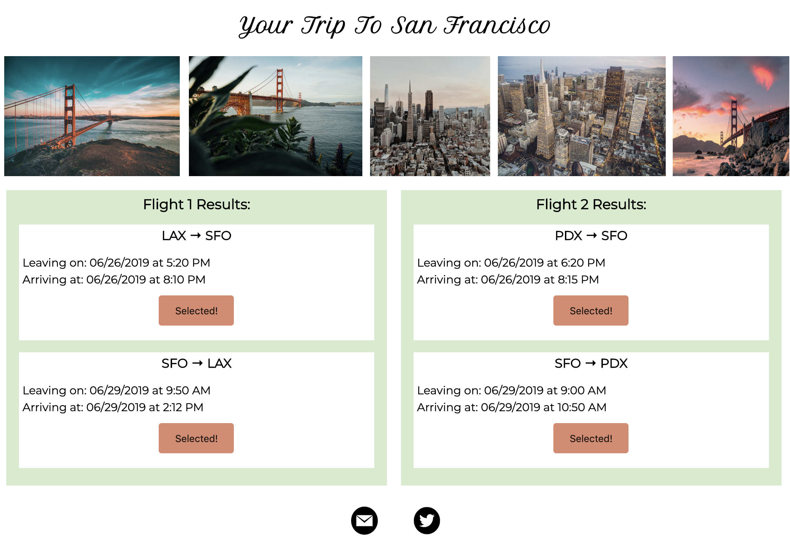

# MeetMe
A travel solutions app, helping people from two different departure cities coordinate flights to the same destination.

## Live Page
https://greffly.github.io/MeetMe-API-Hack/ 

## Motivation
Having friends, family, and coworkers all over the country, I have always wanted an app that easily helped me coordinate travel with others. 

## Built With
HTML, CSS, JavaScript, jQuery, Hipmunk API and Unsplash API

## Features
* Search for flights from two different departure locations to one common destination.
* View photos of your prospective destination.
* Scroll through up to 10 different departing and returning flight options. 
* Select a departing and return flight for each traveler.
* Share this site with others through twitter or email.

## Screenshots
### Landing Page:

### Search Results:

### Selected Flights:

## Struggles
* Parsing the JSON was the hardest part of this project for me, as it was nested fairly complexly, and needed to be transformed to be readable. The reason price and booking links are not on the site, is the information is nested in another object, linked by a third object, all connected by two different ids. At the time of creating this project (about 2 months into JavaScript), this hurdle became too time-consuming to tackle, and has been promoted to "future feature!".
* Running API calls for 4 different flight legs and having them return information to the correct space on the page was a big hurdle during this project. Although I was able to get it working by literally writing 4 different API calls, I have plans to go back and clean this code up so it is one call with 4 different outcomes.

## Future Plans
* Implement up to date price feature.
* Add autocomplete for airport code and cities, so users don't have to memorize airport codes.
* Add more extensive destination information.
* Add lightbox to allow users to click on a photo and view it full size.
